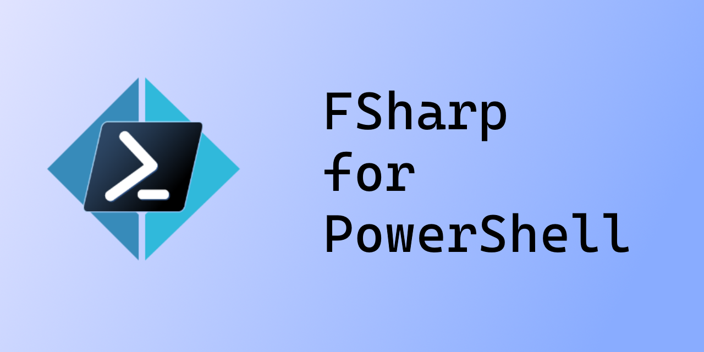

This is a PowerShell module to enable use of the F# language in PowerShell. It is currently only supported with Powershell 7.2+ at the moment.

## Quickstart
```ps
Install-Module FSharp
Add-FSharpType -TypeDefinition @'
namespace Test
type Car = {
  model: string
  name: string
  speed: int
}
'@
[Test.Car]::new('Mazda','Miata',65)
```

```
model name  speed
----- ----  -----
Mazda Miata    65
```